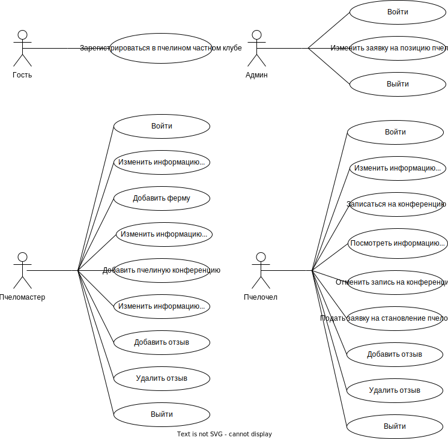
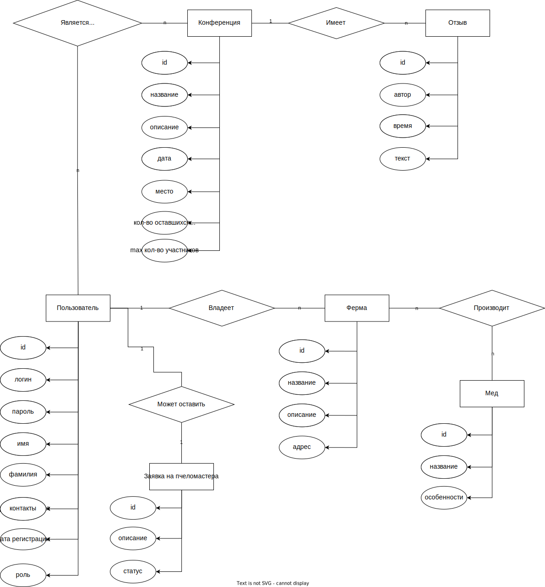
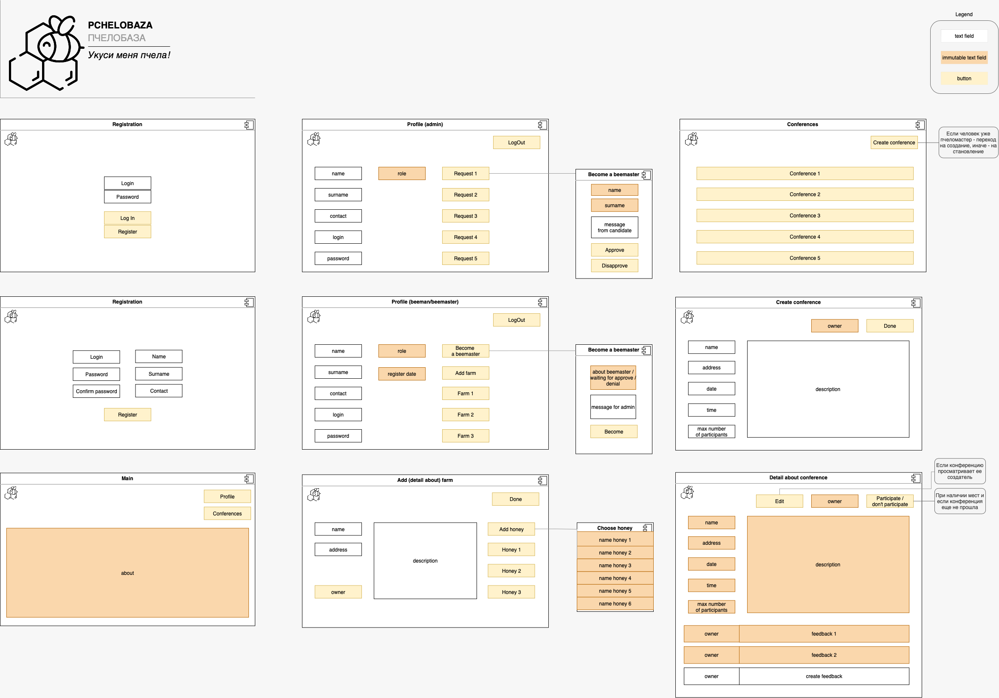

## PCHELOBAZA

### Summary
- Backend для форума пчеловодов
- Frontend делала [@poliorang](https://github.com/poliorang) и можно его найти [тут](https://github.com/poliorang/web_pchelobaza_bmstu7)
- Golang feat. postgres master-slave (gin + sqlx)
- Nginx (я даже сама его пересобрала с нужным модулем!)
- Rest api (ну типа)
- Все в контейнерах и должно красиво подниматься!


### Запуск
```docker-compose up -d``` — поднимает 8 контейнеров:
- web-postgres — master postgres;
- web-postgres-slave — логично postgres slave;
- web-backend — главный инстанс с возможностью записи;
- web-backend-ro-1 — для балансировки get-запросов 2:1:1;
- web-backend-ro-2 — для балансировки get-запросов 2:1:1 [2];
- web-backend-mirror — для /mirror1/api/v1, использует potgres slave;
- web-pgadmin — для красивого просмотра postgres;
- web-nginx — **главный** в этой тусовке.

### Приколы
- В nginx подменяется имя сервера в заголовках на pchelobaza + gzip-сжатие (nginx самая красивая часть работы)
- Swagger красиво рендерится с помощью [swagger-ui](https://github.com/swagger-api/swagger-ui)
- Нагрузочное тестирование с помощью ApacheBenchmark (результаты в конце md, но там кажется ничего особо интересного)
- Используются JWT-токены для авторизации
- Балансировка get-запросов 2:1:1 через nginx сделана, но по-хорошему на ro инстансах надо сделать ro доступ к бд с помощью ролей, но я просто эти инстансы подключила к postgres slave
- Для локального запуска есть свой .env файл в /backend, но тогда нужно раскоментить строчки в коде для его чтения в /backend/internal/app/config.go
- Есть mirror-backend, который использует postgres slave (правда кажется я это сломала...)
- До того, как нужен был master-slave я использовала обычный postgres образ, но для master-slave — [bitnami/postgresql](https://hub.docker.com/r/bitnami/postgresql), который у меня, кажется, каждый раз заново инициализирует бд
- Есть вероятность, что мы что-то не протестили или не поправили в swagger
- В PATCH запросах нужно указывать абсолютно все поля


### API
Помимо прямых запросов на бэк с /api/v1 есть:
- localhost:8089/ — тестовые экраны будушего приложения
- localhost:8089/test/ — редирект на предыдущий пункт
- localhost:8089/documentation — документация (все то что тут внизу)
- localhost:8089/admin — редирект на pgadmin
- localhost:8089/status — классический nginx status
- localhost:8089/api/v1 — **красивый** swagger! можно покидать запросы на /api/v1 или на /mirror/api/v1, ну или на локально развернутый бэк, но тут удачи с cors

---- 

#### Слоган — Укуси меня пчела!
#### Цель работы — создать сервис для пчеловодов.
#### Краткий перечень функциональных требований:
- регистрация и аутентификация пчелочелов;
- добавление, редактирование и удаление контента (информация о себе/ферма/конференция/отзыв);
- просмотр ферм/конференций/отзывов/информации о пчелочелах;
- возможность оставить заявку на повышение прав.
-----

#### Use-case диаграмма системы

-----

#### BPMN диаграмма основных бизнес-процессов

-----


#### Примеры описания основных пользовательских сценариев:
- пользователь может зарегестрироваться как пчелочел;
- пользователь может зайти в систему и выйти из нее;
- пчелочел/пчеломастер/админ может изменять информацию о себе;
- пчелочел может отправить заявку, чтобы стать пчеломастером;
- админ может одобрить заявку пчелочела стать пчеломастером;
- пчелочел/пчеломастер может добавить/изменить информацию о своей ферме; 
- пчеломастер может добавить/изменить пчелоконференцию;
- пчелочел/мастер может записаться на пчелоконфцеренцию в случае, если на нее еще остались места или удалить свою запись;
- пчелочел/пчеломастер может добавить/удалить отзыв на конференцию.

-----

#### ER-диаграмма сущностей


-----

#### Диаграмма БД


-----

#### Компонентная диаграмма системы


-----

#### Экраны будущего web-приложения на уровне черновых эскизов.



### Нагрузочное тестирование 
#### 1 инстанс
```
Server Software:        nginx/1.24.0
Server Hostname:        localhost
Server Port:            8089

Document Path:          /api/v1/honey
Document Length:        3530 bytes

Concurrency Level:      1
Time taken for tests:   28.637 seconds
Complete requests:      10000
Failed requests:        0
Total transferred:      36740000 bytes
HTML transferred:       35300000 bytes
Requests per second:    349.20 [#/sec] (mean)
Time per request:       2.864 [ms] (mean)
Time per request:       2.864 [ms] (mean, across all concurrent requests)
Transfer rate:          1252.90 [Kbytes/sec] received

```
Connection Times (ms)
|          | min      | mean[+/-sd]|        | median   | max      |
|----------|----------|----------|----------|----------|----------|
|Connect:  | 0        | 0        |  1.3     |    0     |  129     |
| Processing:  |   2  |  3  | 4.3    |  2  |   169|
| Waiting:  |      2  |  2 |  3.6 |     2   |  169|
|Total:       |   2 |   3 |  4.5   |   3   |  169|

Percentage of the requests served within a certain time (ms)

| | |
|----------|----------|
  | 50%   |   3 |
  | 66%   |   3|
  | 75%   |   3|
 | 80%   |   3|
  | 90%   |   3|
  | 95%   |   3|
  | 98%   |   4|
  | 99%   |   4|
 | 100%   | 169 (longest request)|


#### 3 инстанса
```
Server Software:        nginx/1.24.0
Server Hostname:        localhost
Server Port:            8089

Document Path:          /api/v1/honey
Document Length:        3530 bytes

Concurrency Level:      3
Time taken for tests:   16.646 seconds
Complete requests:      10000
Failed requests:        0
Total transferred:      36740000 bytes
HTML transferred:       35300000 bytes
Requests per second:    600.74 [#/sec] (mean)
Time per request:       4.994 [ms] (mean)
Time per request:       1.665 [ms] (mean, across all concurrent requests)
Transfer rate:          2155.39 [Kbytes/sec] received

```

Connection Times (ms)
|          | min      | mean[+/-sd]|        | median   | max      |
|----------|----------|----------|----------|----------|----------|
|Connect:  | 0        | 0        |   0.1    |    0     |   5     |
| Processing:|     3  |   5 | 2.2|      4 |     62|
| Waiting:   |     2  |   4 | 2.0|      4 |     42|
| Total:     |     3  |   5 | 2.2|      4 |     62|


Percentage of the requests served within a certain time (ms)
| | |
|----------|----------|
|  50% |      4 |
|  66% |      5 |
|  75% |      5 |
|  80% |      6 |
|  90% |      7 |
|  95% |      7 |
|  98% |      9 |
|  99% |     11 |
| 100% |     62 (longest request)| 


