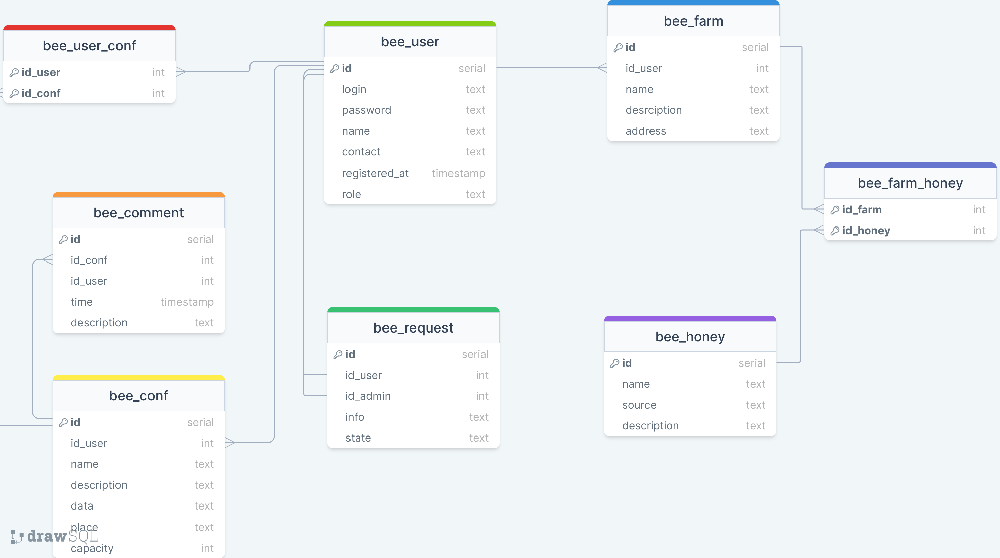

## pchelobaza 
##### Слоган — Укуси меня пчела!

##### Цель работы — создать сервис для пчеловодов.

##### Краткий перечень функциональных требований:
- регистрация и аутентификация пчелочелов;
- добавление, редактирование и удаление контента (информация о себе/ферма/конференция/отзыв);
- просмотр ферм/конференций/отзывов/информации о пчелочелах;
- возможность оставить заявку на повышение прав.

##### Use-case диаграмма системы

##### BPMN диаграмма основных бизнес-процессов

##### Примеры описания основных пользовательских сценариев:
- пользователь может зарегестрироваться как пчелочел;
- пользователь может зайти в систему и выйти из нее;
- пчелочел/пчеломастер/админ может изменять информацию о себе;
- пчелочел может отправить заявку, чтобы стать пчеломастером;
- админ может одобрить заявку пчелочела стать пчеломастером;
- пчелочел/пчеломастер может добавить/изменить информацию о своей ферме; 
- пчеломастер может добавить/изменить пчелоконференцию;
- пчелочел/мастер может записаться на пчелоконфцеренцию в случае, если на нее еще остались места или удалить свою запись;
- пчелочел/пчеломастер может добавить/удалить отзыв на конференцию.

##### ER-диаграмма сущностей

##### Диаграмма БД

##### Компонентная диаграмма системы

##### Экраны будущего web-приложения на уровне черновых эскизов.